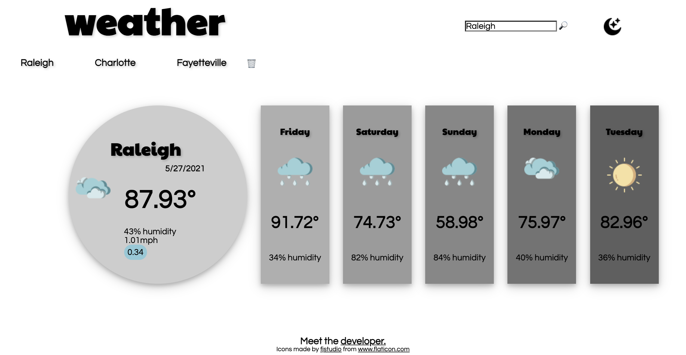

# weatherApp

[Deployed Link](https://zchalk.github.io/weatherApp/)

## Description
A web app that collects weather data for a given city. Upon load, the app will try and collect your home location and render weather data of that location. If the user does not wish to share location, the user has the option to input the city name directly. All searches are saved to be accessed by the user at a later time. The user also has the option to delete their history and chose light mode or dark mode. 

## 3rd Party Sources
[OpenWeather API](https://openweathermap.org/api)
[Flaticon](https://www.flaticon.com/authors/fjstudio)

